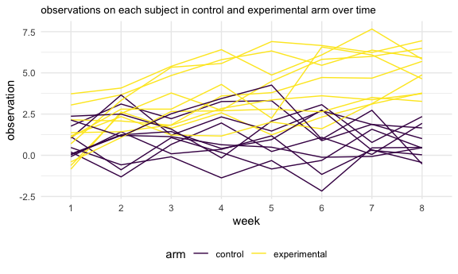

P8105 Homework 5
================
Yihan Qiu

``` r
library(tidyverse)
```

    ## ── Attaching packages ─────────────────────────────────────── tidyverse 1.3.1 ──

    ## ✓ ggplot2 3.3.5     ✓ purrr   0.3.4
    ## ✓ tibble  3.1.4     ✓ dplyr   1.0.7
    ## ✓ tidyr   1.1.3     ✓ stringr 1.4.0
    ## ✓ readr   2.0.1     ✓ forcats 0.5.1

    ## ── Conflicts ────────────────────────────────────────── tidyverse_conflicts() ──
    ## x dplyr::filter() masks stats::filter()
    ## x dplyr::lag()    masks stats::lag()

``` r
knitr::opts_chunk$set(
  fig.width = 6,
  fig.asp = .6,
  out.width = "90%"
)

theme_set(theme_minimal() + theme(legend.position = "bottom"))

options(
  ggplot2.continuous.colour = "viridis",
  ggplot2.continuous.fill = "viridis"
)

scale_colour_discrete = scale_colour_viridis_d
scale_fill_discrete = scale_fill_viridis_d
```

## Problem 2

The code chunk below creates a tidy dataframe containing data from all
participants, including the subject ID, arm, and observations over time.

``` r
df = tibble(
  file_name = list.files("p8105_hw5_data")) %>% 
  mutate(
    file_path = str_c("p8105_hw5_data/", file_name),
    subject_data = purrr::map(.x = file_path, ~ read_csv(.x))) %>% 
  unnest(subject_data)
  
tidy_df = df %>%
  mutate(arm_id = str_remove(file_name, ".csv")) %>%
  separate(arm_id, into = c("arm", "subject_id"), sep = "_") %>%
  mutate(arm = recode(arm, `con` = "control", `exp` = "experimental")) %>%
  pivot_longer(
    week_1:week_8,
    names_prefix = "week_",
    names_to = "week",
    values_to = "observation"
  ) %>%
  select(-file_name, -file_path)
tidy_df
```

    ## # A tibble: 160 × 4
    ##    arm     subject_id week  observation
    ##    <chr>   <chr>      <chr>       <dbl>
    ##  1 control 01         1            0.2 
    ##  2 control 01         2           -1.31
    ##  3 control 01         3            0.66
    ##  4 control 01         4            1.96
    ##  5 control 01         5            0.23
    ##  6 control 01         6            1.09
    ##  7 control 01         7            0.05
    ##  8 control 01         8            1.94
    ##  9 control 02         1            1.13
    ## 10 control 02         2           -0.88
    ## # … with 150 more rows

The code chunk below makes a spaghetti plot showing observations on each
subject over time.

``` r
tidy_df %>%
  ggplot(aes(x = week, y = observation, color = arm)) +
  geom_line(aes(group = interaction(arm, subject_id))) +
  labs(title = "observations on each subject in control and experimental arm over time") + theme(plot.title = element_text(size = 10))
```



From the plot above, we can see that in general, the observations on
subjects in experimental arm are higher than the observations on
subjects in the control arm. Plus, in contrast with observations on
subjects in the control arm, which barely exhibit any trends, we can
observe a slow but steady increase in observations on subjects in the
experimental arm.

## Problem 3

The code chunk below loads the iris dataset from the tidyverse package
and introduces some missing values in each column.

``` r
set.seed(10)

iris_with_missing = iris %>% 
  map_df(~replace(.x, sample(1:150, 20), NA)) %>%
  mutate(Species = as.character(Species))
```

The code chunk below writes a function that takes a vector as an
argument, replaces missing values as required, and returns the resulting
vector.

``` r
fill_missing = function(x) {
  if (is.numeric((x))) {
    x = replace_na(x, mean(x, na.rm = TRUE)) %>%
      round(digits = 1)
  }
  else if (is.character(x)) {
    x = replace_na(x, "Virginica")
  }
  
  return(x)
}
```

The code chunk below applies the above function into columns of the
dataset iris\_with\_missing using a map statement.

``` r
iris_filled = map(iris_with_missing, fill_missing)
iris_filled
```

    ## $Sepal.Length
    ##   [1] 5.1 4.9 4.7 4.6 5.0 5.4 5.8 5.0 4.4 4.9 5.4 4.8 5.8 4.3 5.8 5.7 5.4 5.1
    ##  [19] 5.7 5.1 5.4 5.1 4.6 5.8 4.8 5.0 5.0 5.2 5.8 4.7 4.8 5.4 5.2 5.5 4.9 5.0
    ##  [37] 5.5 4.9 4.4 5.1 5.0 4.5 4.4 5.0 5.1 4.8 5.1 4.6 5.3 5.0 7.0 6.4 6.9 5.5
    ##  [55] 6.5 5.7 6.3 4.9 6.6 5.2 5.0 5.9 6.0 6.1 5.6 6.7 5.6 5.8 6.2 5.6 5.9 5.8
    ##  [73] 6.3 5.8 6.4 6.6 6.8 6.7 6.0 5.7 5.5 5.8 5.8 6.0 5.4 5.8 6.7 5.8 5.6 5.5
    ##  [91] 5.5 5.8 5.8 5.0 5.8 5.7 5.7 6.2 5.1 5.7 6.3 5.8 7.1 6.3 6.5 7.6 4.9 7.3
    ## [109] 6.7 5.8 6.5 5.8 6.8 5.7 5.8 6.4 6.5 7.7 7.7 6.0 5.8 5.6 7.7 6.3 6.7 7.2
    ## [127] 6.2 6.1 6.4 7.2 7.4 7.9 6.4 5.8 6.1 5.8 5.8 6.4 6.0 6.9 6.7 6.9 5.8 6.8
    ## [145] 6.7 6.7 6.3 6.5 5.8 5.9
    ## 
    ## $Sepal.Width
    ##   [1] 3.5 3.0 3.2 3.1 3.6 3.9 3.4 3.4 2.9 3.1 3.1 3.4 3.1 3.0 4.0 4.4 3.9 3.5
    ##  [19] 3.8 3.8 3.4 3.7 3.6 3.3 3.4 3.0 3.4 3.5 3.4 3.2 3.1 3.1 3.1 4.2 3.1 3.2
    ##  [37] 3.5 3.6 3.0 3.4 3.5 3.1 3.2 3.5 3.8 3.0 3.8 3.2 3.7 3.1 3.1 3.2 3.1 2.3
    ##  [55] 2.8 2.8 3.3 2.4 2.9 2.7 2.0 3.0 2.2 2.9 2.9 3.1 3.0 3.1 2.2 2.5 3.2 2.8
    ##  [73] 2.5 2.8 2.9 3.0 2.8 3.1 3.1 2.6 2.4 2.4 2.7 2.7 3.0 3.4 3.1 3.1 3.0 2.5
    ##  [91] 3.1 3.1 3.1 2.3 2.7 3.0 2.9 2.9 2.5 2.8 3.1 2.7 3.0 2.9 3.1 3.0 2.5 2.9
    ## [109] 3.1 3.6 3.2 2.7 3.0 3.1 2.8 3.2 3.0 3.8 2.6 2.2 3.2 3.1 2.8 2.7 3.3 3.2
    ## [127] 2.8 3.0 2.8 3.0 2.8 3.8 2.8 2.8 3.1 3.0 3.4 3.1 3.0 3.1 3.1 3.1 2.7 3.2
    ## [145] 3.3 3.0 2.5 3.0 3.4 3.0
    ## 
    ## $Petal.Length
    ##   [1] 1.4 1.4 1.3 1.5 1.4 1.7 1.4 1.5 1.4 3.8 1.5 1.6 1.4 3.8 3.8 1.5 1.3 1.4
    ##  [19] 1.7 1.5 1.7 1.5 1.0 3.8 1.9 3.8 1.6 1.5 1.4 1.6 3.8 1.5 1.5 1.4 3.8 1.2
    ##  [37] 1.3 1.4 1.3 1.5 1.3 1.3 1.3 1.6 1.9 1.4 1.6 3.8 1.5 1.4 4.7 4.5 4.9 4.0
    ##  [55] 4.6 4.5 4.7 3.8 4.6 3.9 3.8 4.2 4.0 4.7 3.6 4.4 4.5 4.1 4.5 3.9 4.8 4.0
    ##  [73] 4.9 3.8 4.3 4.4 4.8 5.0 4.5 3.5 3.8 3.7 3.9 5.1 4.5 4.5 4.7 4.4 3.8 4.0
    ##  [91] 4.4 4.6 4.0 3.3 4.2 4.2 4.2 4.3 3.0 4.1 3.8 5.1 5.9 5.6 5.8 6.6 4.5 6.3
    ## [109] 3.8 3.8 5.1 5.3 5.5 5.0 5.1 5.3 3.8 6.7 6.9 5.0 5.7 4.9 6.7 4.9 5.7 6.0
    ## [127] 4.8 4.9 5.6 5.8 6.1 3.8 3.8 5.1 5.6 6.1 5.6 5.5 4.8 5.4 5.6 5.1 5.1 3.8
    ## [145] 3.8 5.2 5.0 5.2 5.4 5.1
    ## 
    ## $Petal.Width
    ##   [1] 0.2 0.2 0.2 1.2 0.2 0.4 0.3 0.2 0.2 0.1 0.2 0.2 0.1 0.1 0.2 0.4 0.4 1.2
    ##  [19] 0.3 1.2 0.2 0.4 0.2 0.5 0.2 0.2 0.4 0.2 0.2 0.2 0.2 0.4 0.1 0.2 0.2 0.2
    ##  [37] 0.2 0.1 1.2 0.2 0.3 1.2 0.2 0.6 0.4 0.3 0.2 0.2 0.2 0.2 1.4 1.5 1.5 1.3
    ##  [55] 1.5 1.3 1.6 1.0 1.3 1.4 1.0 1.5 1.2 1.4 1.3 1.4 1.5 1.0 1.5 1.1 1.8 1.3
    ##  [73] 1.5 1.2 1.3 1.4 1.4 1.2 1.2 1.0 1.1 1.0 1.2 1.6 1.5 1.6 1.2 1.3 1.2 1.2
    ##  [91] 1.2 1.2 1.2 1.2 1.3 1.2 1.3 1.3 1.2 1.3 2.5 1.9 2.1 1.8 2.2 2.1 1.7 1.8
    ## [109] 1.8 2.5 2.0 1.9 2.1 2.0 2.4 2.3 1.8 1.2 2.3 1.5 1.2 2.0 2.0 1.8 2.1 1.8
    ## [127] 1.8 1.8 2.1 1.6 1.2 2.0 2.2 1.5 1.4 2.3 1.2 1.2 1.8 2.1 2.4 2.3 1.9 2.3
    ## [145] 2.5 2.3 1.9 2.0 2.3 1.8
    ## 
    ## $Species
    ##   [1] "setosa"     "setosa"     "setosa"     "setosa"     "setosa"    
    ##   [6] "setosa"     "setosa"     "setosa"     "setosa"     "setosa"    
    ##  [11] "setosa"     "setosa"     "setosa"     "setosa"     "setosa"    
    ##  [16] "setosa"     "setosa"     "setosa"     "setosa"     "setosa"    
    ##  [21] "setosa"     "Virginica"  "setosa"     "setosa"     "Virginica" 
    ##  [26] "setosa"     "Virginica"  "setosa"     "setosa"     "setosa"    
    ##  [31] "setosa"     "setosa"     "setosa"     "setosa"     "setosa"    
    ##  [36] "setosa"     "setosa"     "setosa"     "setosa"     "setosa"    
    ##  [41] "setosa"     "Virginica"  "setosa"     "setosa"     "setosa"    
    ##  [46] "Virginica"  "setosa"     "setosa"     "setosa"     "setosa"    
    ##  [51] "Virginica"  "versicolor" "versicolor" "versicolor" "versicolor"
    ##  [56] "versicolor" "Virginica"  "versicolor" "Virginica"  "versicolor"
    ##  [61] "versicolor" "versicolor" "versicolor" "versicolor" "versicolor"
    ##  [66] "versicolor" "versicolor" "versicolor" "versicolor" "versicolor"
    ##  [71] "versicolor" "Virginica"  "versicolor" "versicolor" "versicolor"
    ##  [76] "versicolor" "versicolor" "versicolor" "versicolor" "Virginica" 
    ##  [81] "versicolor" "versicolor" "versicolor" "versicolor" "versicolor"
    ##  [86] "versicolor" "versicolor" "versicolor" "versicolor" "versicolor"
    ##  [91] "versicolor" "versicolor" "versicolor" "Virginica"  "versicolor"
    ##  [96] "versicolor" "versicolor" "versicolor" "versicolor" "Virginica" 
    ## [101] "virginica"  "virginica"  "virginica"  "virginica"  "virginica" 
    ## [106] "virginica"  "virginica"  "virginica"  "virginica"  "virginica" 
    ## [111] "virginica"  "virginica"  "Virginica"  "virginica"  "Virginica" 
    ## [116] "virginica"  "virginica"  "Virginica"  "Virginica"  "virginica" 
    ## [121] "virginica"  "virginica"  "virginica"  "virginica"  "virginica" 
    ## [126] "virginica"  "virginica"  "Virginica"  "virginica"  "virginica" 
    ## [131] "virginica"  "virginica"  "virginica"  "virginica"  "virginica" 
    ## [136] "virginica"  "Virginica"  "virginica"  "virginica"  "virginica" 
    ## [141] "virginica"  "virginica"  "virginica"  "virginica"  "virginica" 
    ## [146] "virginica"  "Virginica"  "Virginica"  "virginica"  "virginica"
